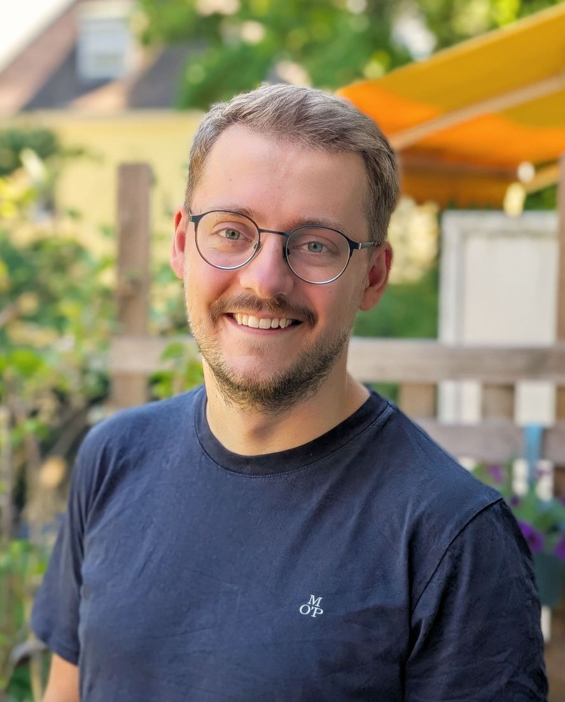

::: article
::: paragraph
::: text

I'm a software engineer based in Munich interested in machine learning, cloud computing, human-computer interaction, functional programming, data visualization and mixed reality.

&nbsp;
 
Since July 2025, I work as an AI & MLOps Engineer at [TÜV Süd Digital Service](https://www.tuvsud.com/en).

&nbsp;

My most recent position was as a Senior Machine Learning Engineer at [Machine Learning Reply](https://www.reply.com/machine-learning-reply/de/). At ML Reply, I built ML and streaming platforms on Azure and in hybrid cloud envioronments for clients in the telecommunications, insurance and automotive industry.  

&nbsp;

Before that I worked as a working student at Microsoft Munich in the [Microsoft Technology Center](https://www.microsoft.com/en-us/mtc) building showcases and conducting workshops in the domain of Machine Learning.  

&nbsp;

In 2020, I wrote my master thesis, titled "Model agnostic Feature Importance by Loss Measures", in which I worked on Interpretable Machine Learning at the [Statistical Learning and Data Science Group](https://www.slds.stat.uni-muenchen.de/research/explainable-ai.html) at LMU Munich. 

&nbsp;

I studied computer science (M.Sc.) at [LMU Munich](https://www.en.uni-muenchen.de/index.html) with a focus on Data Science and Software Engineering. Previously, I've completed my bachelor of Media Informatics at LMU Munich, writing my bachelor thesis at [Lancaster University](https://www.lancaster.ac.uk/) about Interaction in VR.  

&nbsp;

I've also [co-written papers](https://scholar.google.de/citations?user=ZHmZq24AAAAJ&hl=en) about gaze- and gesture interaction in VR ([SUI 2017](https://dl.acm.org/citation.cfm?id=3132180), [IEEE VR 2019](http://ieeevr.org/2019/program/papers.html)) and worked at [Machine Learning Reply](https://www.reply.com/machine-learning-reply/de/), [Intel Mobile Communications](https://www.intel.com/content/www/us/en/wireless-network/5g-technology-overview.html), [Siemens AG](https://www.plm.automation.siemens.com/global/en/products/collaboration/mbse-model-based-systems-engineering.html), the [Usable Security and Privacy group of Bundeswehr University](https://www.unibw.de/usable-security-and-privacy/) and [LMU Munich](https://www.medien.ifi.lmu.de/).  

&nbsp;

In my free time I go swimming, do ju-jutsu (if my knee allows it), brew tea, play dungeons & dragons with friends, tend to my plants and bike through Munich.

&nbsp;

Feel free to contact me at
.

:::
::: image
{height="16em"} \
:::
:::
:::